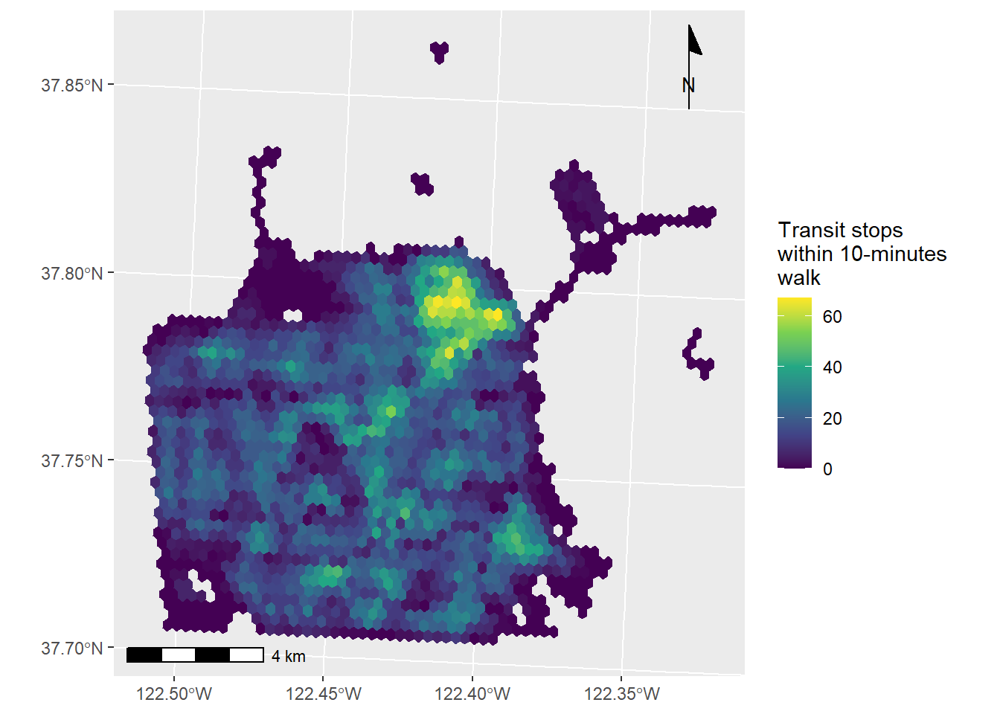
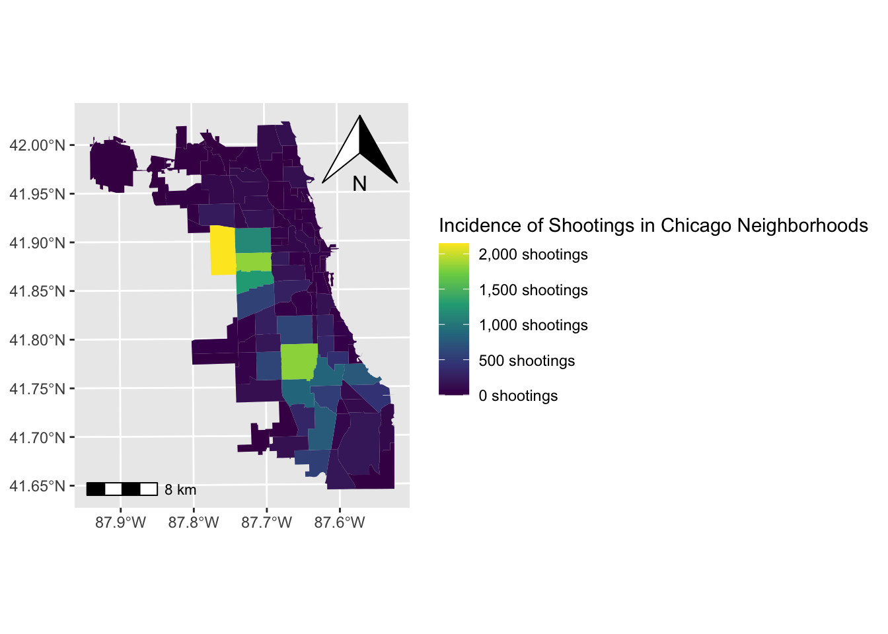
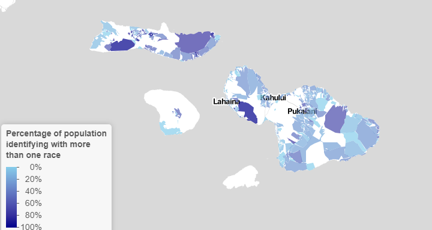

```{r setup, include=FALSE}
knitr::opts_chunk$set(echo = TRUE)
```

# INTRODUCTION

This portfolio has been created as a part of VIS 2128 course at the Harvard Graduate School of Design to showcase the author's skills in spatial mapping and analysis.


# MUMBAI: LAND EXPANSION

## Georeferenced Map
* Skill: Georeferencing a historic map and adding layers of spatial data on the same

This map shows administrative boundaries of the Indian city that I belong to, Mumbai, pre and post colonialism. Mumbai was previously a set of small islands but over the years (and primarily during the British regime), it saw rapid expansion and land reclamation as can be seen in the historic map and polygon layers represented here.

[](){target="_blank"}


# SAN FRANCISCO: ACCESS TO TRANSIT

The following three maps display public transportation accessibility in the city of San Francisco, California. 

## Transit stops within walking distance
* Skill: Calculating and displaying accessibility, based on travel time

The map below shows the number of transit stops that one can walk to within 10 minutes of walk from any point in the map. It is apparent that the highest concentration of transit stops is in the North-East part of the city, with certain parts having access to more than 60 transit stops within a short walking distance. 


[](){target="_blank"}

## Accessibility Score
* Skill: Calculating and displaying accessibility, based on travel time
* Skill: Converting between raster layers and vector layers
* Skill: Displaying raster data on a map


This map leverages information from the previous one to create and display an accessibility score for different areas in the city on a raster map. The score is calculated based on a distance-decay function of the walking time to the nearest transit stop. It is an abstract and normalized means of communicating ease of access on a scale of 0 to 60.

[.png)](https://c-voulgaris.github.io/portfolio_examples/fullsize/SLO_transit.pdf){target="_blank"}

## Combining adjacent areas with the same Accessibility Scores
* Skill: Calculating and displaying accessibility, based on travel time
* Skill: Converting between raster layers and vector layers
* Skill: Displaying raster data on a map


The following map continues to build on the previous one by merging adjacent grid cells that have the same value to create polygons. This helps us group larger areas within the city based on ease of accessibility, which is helpful when one is planning at a cross-neighborhood scale. As we can see from the nuances of the grids, there aren't large parts of the city where adjacent areas have the exact same accessibility scores. 

[.png)](){target="_blank"}


# CHICAGO: SHOOTINGS AND POLICE STATIONS

The following two maps analyze issues of shootings and police stations in Chicago.

## Incidence of Shootings
* Skill: Aggregating point data to a layer of polygons

This map indicates the number of shootings in each Chicago neighborhood. A cursory glance at the map indicates a comparatively higher proportion of shootings along the central part of Chicago with lower numbers along the city borders.

[](){target="_blank"}

## Number of Police Stations
* Skill: Aggregating point data to a layer of polygons

In this map, I attempt to investigate how many Chicago neighborhoods have police stations located in them. The code outlines these neighborhoods in pink, and adds a summary of the total number of neighborhoods fulfilling this criteria. 

[](){target="_blank"}


# MAUI: MULTIRACIAL POPULATION

* Skill: Displaying data on an interactive map
* Skill: Aggregating point data to a layer of polygons

On clicking the image below, you would be directed to an interactive map in a new tab. The map displays the percentage of population identifying with more than one race in different areas of Maui, as reported in the United States Decennial Census of 2010 . Hovering over the specific polygons will provide the reader with information about the Census block, while clicking it will allow them to read the total population and percentage of multiracial population in that block. 

[](https://ma-us-2021.github.io/spatialanalysis/Link/Final_Interactive Map_Manasa Achrya){target="_blank"}


